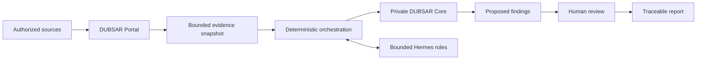

# DUBSAR Architecture

This document describes the public product boundary. It deliberately omits private implementation details, credentials, internal policies and deployment topology.

## Product path

DUBSAR is being built around a portal-first audit journey for business automations and AI agents.



The intended sequence is:

1. an authorized user defines a bounded audit scope;
2. approved exports or connectors provide only the required evidence;
3. DUBSAR freezes the evidence scope and records content digests;
4. deterministic controls evaluate explicit conditions;
5. specialized Hermes roles analyze or explain bounded material;
6. the Core preserves canonical state, provenance and limitations;
7. a human confirms, corrects or rejects proposed findings;
8. the report preserves evidence, decisions and scope limits.

The complete browser journey is still being consolidated. This architecture is the target product boundary, not a production-readiness claim.

## Responsibility boundaries

### Public website

`dubsar.ai` explains the product, its method and its limitations. A short orientation questionnaire may help a visitor understand whether an audit is relevant, but it is not itself an audit or a regulatory assessment.

### DUBSAR Portal

The controlled DUBSAR Portal is the intended primary user surface. Its public
hostname must not be advertised until the access, privacy and isolation
boundaries have passed review.

It combines:

- authentication and access control;
- a conversational and task-oriented interface;
- project and audit scope;
- evidence import or connection;
- progress and availability states;
- finding review;
- human decisions;
- report access.

LibreChat can provide part of the portal shell. DUBSAR remains responsible for the audit contracts, evidence boundaries, workflow and authority model.

### Evidence boundary

Every audit starts from a bounded evidence snapshot.

The snapshot records:

- source kind and authorized scope;
- collection window and known retention limits;
- content or projection digests;
- completeness and unavailable reads;
- references that a finding is allowed to cite.

Missing or partial evidence must remain visible. It must never be converted silently into a positive result.

### Deterministic orchestrator

The orchestrator controls the order of the audit.

It is responsible for transitions such as:

```text
accept request
→ freeze evidence
→ apply deterministic controls
→ prepare bounded roles
→ collect role results
→ prepare review
→ await human decision
→ render report
```

An LLM does not decide which protected transition happens next.

### Hermes roles

Hermes supplies specialized agent roles for analysis and explanation.

A role receives:

- a closed objective;
- an explicit control vocabulary;
- bounded evidence references and facts;
- a required output contract;
- a distinct session identity.

Hermes outputs remain non-authoritative proposals. They do not create a Human GO, alter the evidence snapshot or approve their own work.

### Private Backend and Core

The protected Backend is the public product's controlled service boundary.

The private Core owns canonical audit state, including:

- audit and run identity;
- rule-pack identity;
- evidence relationships;
- role packets and accepted results;
- contradictions and limitations;
- review state;
- human decisions;
- report projection.

The Core is proprietary and is not distributed in this repository.

### Human review

Human review is a product boundary, not a decorative checkbox.

The reviewer must be able to see:

- the proposed finding;
- the evidence used;
- the control applied;
- the scope and unavailable evidence;
- the exact review version being decided.

The decision confirms, corrects or rejects a proposal. It does not retroactively turn incomplete evidence into verified evidence.

### Report

The report is a projection of canonical audit state. It must preserve:

- source provenance;
- rule-pack and evidence digests;
- findings and their evidence;
- human dispositions;
- contradictions;
- limitations and unavailable sources.

Rendering a report is not the same as authorizing a deployment, release or regulated use.

## First Rule Pack

The first public product path is being prepared around **Automation Coherence**.

Its current control families cover:

1. duplicate consequences without an attributable idempotency boundary;
2. actions incompatible with an observed business state;
3. missing traceability, version or expected human-validation evidence within the connected scope.

The pack is still being consolidated into the canonical audit contracts. Deterministic fixture validation exists, while the complete portal journey remains in progress.

## Two user surfaces

### Portal users

Business, operations, compliance and agency users work primarily through the portal. They define scope, inspect findings, make review decisions and access reports.

### Technical administrators

A future local Node and administration desktop are intended for technical operators who need to:

- connect local or private systems;
- keep credentials close to the client environment;
- inspect runtime and connector health;
- manage approved policies;
- observe controlled execution.

The Node and desktop are complementary administration surfaces, not a second end-user product and not currently a generally available installation.

## Future continuous governance

Audit is the entry point. Continuous governance is a later product stage.

The intended evolution is:

```text
bounded audit
→ understood workflows and evidence
→ approved rules and owners
→ continuous observation
→ policy decision
→ human approval when required
```

Future policy outcomes may include:

- `ALLOW`;
- `DENY`;
- `REQUIRE_HUMAN_APPROVAL`;
- `ALLOW_WITH_CONDITIONS`.

These outcomes are roadmap capabilities. DUBSAR does not currently claim that it can block arbitrary business actions in production.

## Connector independence

DUBSAR is designed so that n8n, HubSpot, Make, coding-agent hosts and future systems remain evidence or execution surfaces rather than sources of DUBSAR authority.

Connectors should:

- use documented and versioned boundaries;
- expose bounded data;
- fail explicitly;
- avoid sending source credentials to the Core;
- remain replaceable.

A change in a third-party tool may require an adapter update. It must not change the meaning of an existing DUBSAR control silently.

## Developer adapters

Claude Code, Codex and Cursor adapters remain relevant experiments and future integration surfaces.

They are no longer the primary public product story. The first customer-facing product path is the portal audit. Developer adapters may later connect governed development or agent workflows to the same evidence and authority model.

## AI Act boundary

DUBSAR is designed to help document governance-relevant elements such as provenance, traceability, human oversight, scope and retained evidence.

It does not certify AI Act compliance, replace legal analysis or issue a regulatory conformity verdict.

## Public and private boundary

This repository may publish:

- product documentation;
- public contracts and diagrams;
- synthetic fixtures and examples;
- explicitly approved thin adapters;
- security, privacy and integrity information.

It does not publish:

- the proprietary Core;
- private Backend implementation;
- internal prompts or policies;
- confidential evidence or client data;
- secrets, tokens or trust material;
- unreviewed production topology.

## Current maturity

```text
deterministic synthetic-fixture controls: internally validated
recorded audit API path: internal evidence exists
complete portal user journey: in progress
live business connectors: roadmap
continuous policy enforcement: roadmap
local Node / administration desktop: prototype and roadmap
public production availability: no
```

See [STATUS.md](STATUS.md) for the current claim boundary and [ROADMAP.md](ROADMAP.md) for sequencing.
