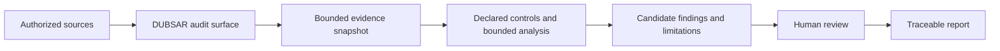

# DUBSAR Architecture

This document describes the public product boundary. It deliberately omits
private implementation details, credentials, internal policies and deployment
topology.

## Current product path

DUBSAR has two current delivery surfaces:

- the automated audit portal, coming soon and under construction and
  validation;
- the Professional DUBSAR Audit, available on request as a bounded,
  human-led engagement.

Both use the same evidence and authority boundaries.



The intended sequence is:

1. an authorized user defines a bounded audit scope;
2. approved exports or connectors provide only required evidence;
3. DUBSAR freezes the evidence scope and records provenance;
4. declared controls evaluate explicit conditions;
5. bounded agent roles may analyze or explain material;
6. facts, inferences, contradictions and limitations remain distinct;
7. a human confirms, corrects or rejects proposed findings;
8. the report preserves evidence, decisions and scope limits.

The complete portal browser journey remains under construction and validation.
The marketing website is public, but the portal is not currently available.

---

## Responsibility boundaries

### Public website

[dubsar.ai](https://dubsar.ai/) explains the product, method and limitations.
Marketing or orientation content is not itself an audit or regulatory
assessment.

### Automated audit portal

The [DUBSAR audit page](https://dubsar.ai/audit) describes the planned
self-service audit. The intended portal supports scope definition, evidence
intake, progress and availability states, finding review, human decisions and
report access.

The implementation, authentication model, private service topology and
credentials are not published in this repository.

### Professional DUBSAR Audit

The Professional DUBSAR Audit is available on request as a separate bounded
engagement. Scope, authorized sources, permissions, retention, deliverables,
timing and price are agreed before work starts.

The engagement remains human-led and read-only by default. It does not bypass
evidence limitations or turn a report into legal certification.

See [AUDIT.md](AUDIT.md).

### Evidence boundary

Every audit starts from a bounded evidence snapshot. Publicly relevant
properties include:

- source kind and authorized scope;
- collection window and known retention limits;
- provenance and version references;
- completeness and unavailable reads;
- references a finding is allowed to cite.

Missing or partial evidence remains visible. It is never silently converted
into a positive result.

### Declared controls and bounded agents

Declared controls produce bounded mechanical results. Agent roles may inspect,
explain, challenge or summarize material under an explicit assignment.

Agent output remains a proposal. It cannot alter the evidence boundary, create
a human approval or promote itself to verified truth.

### Private implementation boundary

Private DUBSAR implementation preserves governed audit state and the declared
authority model. Its internal component layout, source, policies, credentials
and deployment topology are not described or distributed through this
repository.

The proprietary Core remains private.

### Human review

Human review is a product boundary. The reviewer must be able to understand:

- the proposed finding;
- the evidence used;
- the declared control;
- the scope and unavailable evidence;
- the exact state being reviewed.

The decision confirms, corrects or rejects a proposal. It does not
retroactively make incomplete evidence complete.

### Report

The report is intended to preserve source provenance, findings and their
evidence, human dispositions, contradictions, limitations and unavailable
sources.

Rendering a report is not the same as authorizing a deployment, release or
regulated use.

---

## First audit profile

The planned initial portal path centers on **Automation Coherence**. Its current
control families examine:

1. duplicate consequences without an attributable idempotency boundary;
2. actions incompatible with an observed business state;
3. missing traceability, version or expected human-validation evidence within
   the connected scope.

Deterministic fixture validation exists. Complete browser end-to-end proof
remains an active validation boundary.

---

## Separate public skills boundary

The
[dubsar-agent-skills](https://github.com/kotnisofiane-bit/dubsar-agent-skills)
repository publishes MIT-licensed doctrine and bounded local helpers.

Those skills may help structure audit and governance work locally. They are not
the Portal, private Core, runtime or private product
component. They do not provide access to private services and do not represent
a deployment of this architecture.

---

## Possible future continuous governance

Audit is the current entry point. Continuous governance or installed components
may be considered later under a separate scope.

No topology, local-versus-hosted boundary, distribution model, supported
platform, service contract or licence is selected or promised. This document
does not claim an ability to block arbitrary business actions in production.

---

## Historical coding-agent context

Earlier engineering explored coding-agent project governance and a Claude Code
staging package. That work informed the current doctrine but is not a current
product surface, active beta or supported host integration.

The Marketplace staging surface is retired from the active tree. No current
plugin, runtime, beta-access path or platform-support claim is made.

---

## Connector independence

Third-party systems remain evidence or execution surfaces rather than sources
of DUBSAR authority.

Connectors should use documented boundaries, expose bounded data, fail
explicitly and remain replaceable. A third-party change must not silently
change the meaning of an existing DUBSAR control.

---

## AI Act boundary

DUBSAR is designed to help document governance-relevant elements such as
provenance, traceability, human oversight, scope and retained evidence.

It does not certify AI Act compliance, replace legal analysis or issue a
regulatory conformity verdict.

---

## Public and private boundary

This repository may publish:

- product documentation;
- public architecture and diagrams;
- synthetic fixtures and bounded examples;
- security, privacy and integrity information;
- non-executable historical records.

It does not publish:

- the Portal or other private product implementation;
- the proprietary Core;
- private Backend implementation;
- any current installable DUBSAR component;
- internal prompts or policies;
- confidential evidence or client data;
- secrets, tokens or trust material;
- production topology.

---

## Current maturity

```text
deterministic synthetic-fixture controls: internally validated
recorded audit API path: internal evidence exists
automated audit portal: coming soon, under construction and validation
complete portal browser E2E proof: in progress
professional DUBSAR Audit: available on request
public skills: separate MIT-licensed companion resource
historical coding-agent package: paused; no public package or beta
continuous governance / installed components: possible later; architecture and distribution undecided
private Core: proprietary, not distributed
general production availability: not claimed
```

See [STATUS.md](STATUS.md) for the current claim boundary and
[ROADMAP.md](ROADMAP.md) for sequencing.
