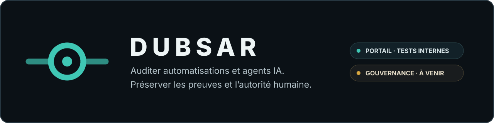

<p align="center">
  
</p>

# DUBSAR

**Auditez vos automatisations. Gouvernez ce qui agit.**

DUBSAR relie les faits, les décisions et les preuves de vos workflows. Le système rend les incohérences visibles, conserve les limites de couverture et remet la validation au responsable humain désigné.

DUBSAR possède aujourd’hui trois surfaces distinctes. Elles partagent une même doctrine, mais pas le même usage ni le même niveau de maturité.

[Découvrir l’audit](https://dubsar.ai/fr/audit) · [Demander un accès bêta](https://dubsar.ai/fr/early-access) · [English version](README.md)

---

## Trois surfaces, une même méthode

| Surface | Usage | Statut actuel |
|---|---|---|
| **Audit automatisé** | Examiner un périmètre d’automatisations, relier les événements disponibles et préparer un rapport validable | Portail en cours de construction et de validation ; bientôt disponible |
| **Audit professionnel DUBSAR** | Examiner un projet ou une automatisation sous mandat, avec sources autorisées et revue humaine | Disponible sur demande |
| **DUBSAR pour agents de code** | Gouverner la construction d’un projet logiciel assisté par des agents | Bêta privée contrôlée, Claude Code en premier |

Ces surfaces ne doivent pas être confondues :

- le portail prépare un premier résultat structuré ;
- l’audit professionnel ajoute un mandat, une analyse et une revue humaines ;
- le produit pour agents de code gouverne un projet pendant sa construction.

---

## 1. Audit automatisé

La page publique de présentation de l’audit constitue le point d’entrée
commercial actuel. Le portail automatisé est encore en cours de construction et
de validation ; il n’est pas encore accessible au public.

Le parcours visé est simple :

1. définir les automatisations, la période et les sources autorisées ;
2. relier les événements disponibles sans inventer de causalité ;
3. signaler les incohérences, incertitudes et informations manquantes ;
4. faire classer les constats par le responsable désigné ;
5. produire un rapport où preuves, limites et validations restent reliées.

Le parcours vise l’autonomie jusqu’au premier rapport. Cette autonomie ne signifie ni décision automatique, ni certification, ni suppression de la responsabilité humaine.

[Découvrir l’audit automatisé](https://dubsar.ai/fr/audit)

---

## 2. Audit professionnel DUBSAR

L’Audit professionnel DUBSAR est une intervention bornée, opérée par Sofiane avec DUBSAR.

Deux mandats principaux sont proposés :

- **préparation au lancement** — le produit est-il réellement prêt à être ouvert aux utilisateurs ?
- **gouvernance des agents** — l’équipe peut-elle expliquer et vérifier comment le projet a été construit et validé ?

L’intervention commence par un accord explicite sur :

- le périmètre ;
- les sources autorisées ;
- les permissions ;
- les limites d’accès ;
- la conservation ;
- le calendrier ;
- le prix.

Le fonctionnement est en lecture seule par défaut. Le rapport distingue les faits, les inférences, les contradictions, les limites et les décisions humaines.

[Comprendre la méthode](AUDIT.fr.md) · [Demander un accompagnement sur Malt](https://www.malt.fr/profile/sofianekotni)

---

## 3. DUBSAR pour agents de code

DUBSAR pour agents de code gouverne les projets logiciels longs, multi-sessions et assistés par l’IA.

Le produit conserve notamment :

- la Mission et les contraintes actives ;
- les décisions et leurs raisons ;
- les preuves reliées aux sources et aux versions ;
- les contradictions entre tickets, documentation, code et tests ;
- l’identité et l’isolation des sessions ;
- les Human Gates nécessaires aux mouvements protégés ;
- le chemin permettant de reprendre ou d’expliquer le projet.

Claude Code est la première intégration. La bêta privée fonctionnelle est en cours de finalisation pour des projets extérieurs sélectionnés, avec Windows comme première cible.

La Marketplace publique n’est pas active. Aucun parcours d’installation publique autonome n’est actuellement revendiqué. Codex, Cursor et les autres adaptateurs appartiennent à la direction future.

[État actuel](STATUS.md) · [Surfaces techniques](PRODUCT_SURFACES.md) · [Demander un accès bêta](https://dubsar.ai/fr/early-access)

---

## Doctrine commune

Toutes les surfaces DUBSAR suivent les mêmes principes :

- seules les sources autorisées sont examinées ;
- une affirmation n’est jamais traitée comme une preuve ;
- les faits et les inférences restent séparés ;
- la provenance et la version des preuves sont conservées ;
- les contradictions et les limites restent visibles ;
- une source absente devient une limite, pas une conformité implicite ;
- la lecture seule est la règle par défaut ;
- aucun agent ne peut approuver seul son propre travail ;
- les décisions protégées restent sous autorité humaine.

**Les systèmes analysent et appliquent des règles déclarées. DUBSAR conserve et vérifie. L’humain autorise et décide.**

---

## Surfaces techniques

L’audit automatisé et le produit pour agents de code utilisent la même discipline, mais des parcours techniques différents.

### Parcours audit

```text
Sources autorisées
    ↓
Portail DUBSAR
    ↓
Preuves, incohérences et limites
    ↓
Validation humaine
    ↓
Rapport
```

Une gouvernance continue ou un DUBSAR Node constitue un déploiement séparé. Elle n’est pas implicite dans le premier diagnostic.

### Parcours agents de code

```text
Agent de code
    ↓
Adaptateur hôte
    ↓
Bridge et environnement local
    ↓
Backend et Core protégés
    ↓
Cockpit, preuves et Human Gates
```

Le Core propriétaire reste privé. Les composants techniques ne constituent pas des marques ou des produits séparés.

---

## AI Act

DUBSAR peut aider à structurer des éléments utiles à une préparation documentaire liée à l’AI Act :

- inventaire des systèmes, agents, responsables et finalités ;
- traçabilité des sources, versions, décisions et validations ;
- supervision humaine explicite ;
- limites, incertitudes et informations manquantes ;
- registres de preuves et de contradictions.

DUBSAR ne fournit aucun conseil juridique, ne délivre aucune certification et ne produit aucun verdict automatique de conformité.

---

## Frontière publique et privée

Ce dépôt constitue la surface publique de documentation et de distribution de DUBSAR.

Il peut contenir :

- la doctrine et l’architecture publiques ;
- des exemples et diagrammes bornés ;
- les informations publiques de sécurité, confidentialité et installation ;
- les adaptateurs hôtes dont la publication a été autorisée.

Il ne publie pas :

- le Core propriétaire ;
- les politiques ou journaux internes ;
- les données de clients ou de testeurs ;
- les secrets, jetons ou éléments de confiance ;
- les détails privés du Backend.

Certains identifiants techniques utilisent encore `scribe` pour compatibilité. Ils ne désignent pas un second produit public.

---

## Documentation

### Comprendre DUBSAR

1. [Pourquoi DUBSAR ?](WHY_DUBSAR.md)
2. [Audit DUBSAR](AUDIT.fr.md)
3. [Produit et surfaces](PRODUCT_SURFACES.md)
4. [État actuel](STATUS.md)
5. [Architecture](ARCHITECTURE.md)
6. [FAQ](FAQ.md)
7. [Feuille de route](ROADMAP.md)

### Distribution et confiance

- [Installation](INSTALLATION.md)
- [Marketplace](MARKETPLACE.md)
- [Sécurité](SECURITY.md)
- [Confidentialité](PRIVACY.md)
- [Intégrité et provenance](INTEGRITY.md)

---

## Créé par

Créé par [**Sofiane Kotni**](https://dubsar.ai/fr/sofiane-kotni/), créateur de DUBSAR et auteur de *Digital Trust*.

[Site DUBSAR](https://dubsar.ai/fr/) · [LinkedIn](https://www.linkedin.com/in/sofiane-kotni/) · [Digital Trust — français](https://www.amazon.fr/dp/B0H739BFJP) · [Digital Trust — anglais](https://www.amazon.fr/dp/B0GZ4RH1KX) · [Page auteur Amazon](https://www.amazon.fr/stores/Sofiane-KOTNI/author/B0H6NBHZTC) · [Malt](https://www.malt.fr/profile/sofianekotni) · [Contact](mailto:contact@dubsar.ai)
