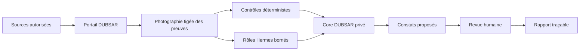

  

# DUBSAR

**Audit et gouvernance des automatisations métiers et agents IA, fondés sur
des preuves.**

DUBSAR est conçu pour aider une organisation à comprendre ce que ses
automatisations et ses agents ont fait, quelles preuves étaient disponibles,
quelle règle s'appliquait et où une décision humaine reste nécessaire.

Le premier parcours produit passe par un portail d'audit :

**sources bornées → photographie des preuves → contrôles déterministes →
rôles agents spécialisés → revue humaine → rapport traçable**

[English version](README.md) · [Site](https://dubsar.ai/fr/) ·
[Pourquoi DUBSAR ?](WHY_DUBSAR.md) · [État actuel](STATUS.md)

> **État du développement :** DUBSAR est en développement actif. Les contrôles
> déterministes et un parcours d'audit par API disposent de preuves techniques
> internes. Le parcours complet d'un utilisateur depuis le portail reste en
> cours de consolidation et ne doit pas encore être présenté comme un service
> de production généralement disponible.

---

## Pourquoi DUBSAR ?

Les automatisations métiers et les agents IA répartissent leurs décisions entre
workflows, modèles, API et systèmes métier. À mesure que cette chaîne grandit,
des questions simples deviennent difficiles :

- qu'est-ce qui a provoqué une action ;
- quelle version d'une règle ou d'un workflow était active ;
- l'action était-elle compatible avec l'état métier connu ;
- une validation humaine était-elle attendue et peut-elle être retrouvée ;
- deux exécutions correspondent-elles au même événement métier ;
- quelles affirmations reposent sur des preuves et lesquelles restent
  incertaines.

DUBSAR ajoute une couche de gouvernance indépendante autour de ces systèmes.
Il ne demande pas à un agent de certifier un autre agent. Il conserve un
périmètre de preuves borné, applique des contrôles déterministes, délègue des
rôles analytiques limités et laisse l'autorité finale à l'humain.

**Les agents assistent. Le Core préserve et vérifie. L'humain décide.**

---

## Premier parcours produit : l'audit depuis le portail

Le portail est le point d'entrée de la première expérience DUBSAR.

1. L'utilisateur définit un périmètre autorisé.
2. Des exports bornés ou des sources connectées sont collectés.
3. DUBSAR fige une photographie des preuves et son empreinte.
4. DUBSAR applique des contrôles déterministes et enregistre leurs résultats
   bornés.
5. Des rôles Hermes spécialisés peuvent examiner, expliquer ou contredire les
   éléments disponibles dans les limites de leur mission.
6. Le Core privé conserve l’état canonique de l’audit et prépare la revue.
7. Les constats proposés sont affichés avec leurs preuves et leurs limites.
8. Un humain les confirme, les corrige ou les rejette.
9. Le rapport conserve la provenance, les décisions et les limites de portée.

Hermes n'est pas l'autorité canonique. La sortie d'un modèle ne peut pas
transformer silencieusement une preuve manquante en fait vérifié, approuver son
propre travail ou contourner un Human Gate.

---

## Premier Rule Pack

Le premier démonstrateur interne porte sur la **cohérence des
automatisations** :

1. actions réussies dupliquées sans frontière d'idempotence attribuable ;
2. actions incompatibles avec un état métier connu ;
3. version du workflow, règle ou validation humaine attendue non retrouvée
   dans les sources analysées.

Les fixtures internes modélisent actuellement des données de workflows proches
d'exports n8n et des états métier proches d'exports HubSpot. Cela ne signifie
pas que des connecteurs directs sont déjà généralement disponibles.

Les résultats restent strictement bornés. « Aucun constat détecté dans le
périmètre analysé » ne signifie pas que le système est globalement conforme,
sûr ou sans défaut.

---

## Surfaces du produit

| Surface | Rôle | Position actuelle |
|---|---|---|
| **Portail DUBSAR** | Entrée de l'audit, consultation des preuves et décisions humaines | Premier parcours produit ; parcours utilisateur complet en validation |
| **Core DUBSAR privé** | État canonique de l’audit, identité du Rule Pack, relations de preuve et Human Gates | Propriétaire ; non distribué dans ce dépôt |
| **Rôles Hermes** | Analyse, explication et contradiction dans un cadre borné | Non autoritatifs par conception |
| **Nœud local / desktop** | Future administration technique et exécution locale contrôlée | Prototype et feuille de route |
| **Plugins développeurs** | Intégrations expérimentales avec des environnements de code | Axe de recherche secondaire |

Le desktop n'est plus présenté comme un produit autonome destiné aux
développeurs. La direction envisagée est celle d'une surface d'administration
technique ou d'un nœud local pour une organisation utilisant DUBSAR.

Claude Code, Codex, Cursor et les intégrations similaires restent des
expérimentations utiles, mais ne constituent plus le positionnement public
principal.

---

## État honnête du projet

| Capacité | État |
|---|---|
| Évaluation déterministe sur fixtures synthétiques | Validée en interne |
| Parcours d'audit par API | Preuve interne enregistrée |
| Parcours complet réalisé uniquement depuis l'interface utilisateur | En validation |
| Connecteurs directs de production | Feuille de route ; non généralement disponibles |
| Gouvernance continue et application de politiques | Feuille de route |
| Blocage ou approbation d'actions métier en production | Feuille de route |
| Nœud local d'administration / desktop | Prototype et feuille de route |
| Distribution publique des plugins développeurs | Pas la voie de lancement actuelle |

La différence entre une interface interactive, un test d'API et une véritable
preuve de bout en bout vécue comme un utilisateur est volontairement
maintenue. DUBSAR ne présentera pas l'un comme l'autre.

---

## IA Act et limite réglementaire

DUBSAR est conçu pour soutenir un travail de gouvernance avec des capacités
telles que l'inventaire, la traçabilité, la provenance des preuves, la
supervision humaine et l'enregistrement des décisions.

DUBSAR ne **certifie pas** la conformité au règlement européen sur l'IA ni à
une autre réglementation. Il n'est ni un organisme d'évaluation de la
conformité, ni un avis juridique, ni un substitut aux professionnels qualifiés
du droit et de la conformité.

Le produit peut aider à collecter et structurer des preuves utiles au travail
de conformité d'une organisation. La conclusion juridique reste hors de
l'autorité de DUBSAR.

---

## Frontière publique et privée

Ce dépôt est une frontière publique de documentation et d'intégration. Il peut
contenir :

- la doctrine du produit, l'architecture publique et les informations d'état ;
- des exemples bornés, schémas, fixtures et diagrammes ;
- les informations publiques de sécurité, confidentialité et installation ;
- de minces adaptateurs hôtes ou métadonnées d'intégration lorsque leur
  publication est autorisée.

Il ne publie pas :

- le Core DUBSAR propriétaire ;
- les détails privés d'implémentation du Backend ;
- les politiques internes, journaux scellés ou éléments de confiance ;
- les données confidentielles de clients ou de test ;
- les identifiants, jetons ou secrets.

Certains identifiants techniques utilisent encore `scribe` pour compatibilité.
Ce sont des noms historiques d'implémentation, pas un second produit public.

---

## Ce que DUBSAR ne prétend pas faire

DUBSAR ne prétend pas :

- remplacer aujourd'hui n8n, les plateformes d'automatisation ou les moteurs
  d'agents ;
- fournir aujourd'hui des connecteurs directs généralement disponibles ;
- permettre aux agents d'approuver leurs propres constats ;
- confondre une formulation convaincante avec une preuve ;
- fusionner, publier, déployer ou exécuter silencieusement une action sensible ;
- certifier une conformité réglementaire ;
- garantir un système sans erreur, sécurisé ou conforme ;
- exposer le Core privé.

---

## Documentation

### Pour commencer

1. [Pourquoi DUBSAR ?](WHY_DUBSAR.md)
2. [Surfaces du produit](PRODUCT_SURFACES.md)
3. [État actuel](STATUS.md)
4. [Architecture](ARCHITECTURE.md)
5. [Feuille de route](ROADMAP.md)
6. [FAQ](FAQ.md)

### Confiance et limites

- [Méthode d'audit](AUDIT.fr.md)
- [Sécurité](SECURITY.md)
- [Confidentialité](PRIVACY.md)
- [Intégrité et provenance](INTEGRITY.md)
- [Limites d'installation](INSTALLATION.md)
- [Adaptateurs développeurs et frontière Marketplace](MARKETPLACE.md)

### Fondations

- [Principes](PRINCIPLES.md)
- [Mémoire des décisions](DECISION_MEMORY.md)
- [Philosophie de conception](DESIGN_PHILOSOPHY.md)
- [Pourquoi pas seulement des agents ?](WHY_NOT_JUST_AGENTS.md)

---

## Créé par

Créé par [**Sofiane Kotni**](https://www.linkedin.com/in/sofiane-kotni/),
créateur de DUBSAR et auteur de *Digital Trust*.

[dubsar.ai](https://dubsar.ai/fr/) ·
[LinkedIn](https://www.linkedin.com/in/sofiane-kotni/) ·
[Digital Trust — français](https://www.amazon.fr/dp/B0H739BFJP) ·
[Digital Trust — anglais](https://www.amazon.fr/dp/B0GZ4RH1KX) ·
[Page auteur Amazon](https://www.amazon.fr/stores/Sofiane-KOTNI/author/B0H6NBHZTC) ·
[contact@dubsar.ai](mailto:contact@dubsar.ai)
