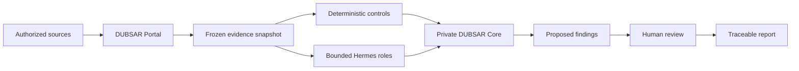

  

# DUBSAR

**Evidence-first audit and governance for business automations and AI agents.**

DUBSAR is being built to help organizations understand what their automations
and agents did, which evidence was available, which rule applied, and where a
human decision is still required.

The first product path is a portal-based audit:

**bounded sources → evidence snapshot → deterministic controls → specialized
agent roles → human review → traceable report**

[Version française](README.fr.md) · [Website](https://dubsar.ai/) ·
[Why DUBSAR?](WHY_DUBSAR.md) · [Current status](STATUS.md)

> **Development status:** DUBSAR is under active development. Deterministic
> controls and an API-backed audit path have internal technical evidence.
> The complete end-user portal journey is still being consolidated and must
> not yet be treated as a generally available production service.

---

## Why DUBSAR?

Business automations and AI agents distribute decisions across workflows,
models, APIs and business systems. As this chain grows, basic questions become
hard to answer:

- What caused an action?
- Which version of a rule or workflow was active?
- Was the action compatible with the known business state?
- Was human approval expected, and can it be found?
- Are two executions duplicates of the same business event?
- Which claims are supported by evidence, and which remain uncertain?

DUBSAR adds an independent governance layer around those systems. It does not
ask an agent to certify another agent. It preserves a bounded evidence set,
applies deterministic controls, delegates limited analytical roles, and keeps
final authority with a human.

**Agents assist. The Core preserves and checks. Humans decide.**

---

## The first product path: portal audit

The portal is the entry point for the initial DUBSAR experience.

1. The user defines an authorized scope.
2. Bounded exports or connected sources are collected.
3. DUBSAR freezes an evidence snapshot and its digest.
4. DUBSAR applies deterministic controls and records their bounded results.
5. Specialized Hermes roles may inspect, explain or challenge the available
   material within a bounded assignment.
6. The private Core preserves canonical audit state and prepares the review.
7. Proposed findings are displayed with their evidence and limitations.
8. A human confirms, corrects or rejects them.
9. The resulting report preserves provenance, decisions and scope limits.

Hermes is not the canonical authority. Model output cannot silently convert
missing evidence into a verified fact, approve its own work, or bypass a Human
Gate.

---

## Initial Rule Pack

The first internal demonstrator focuses on **automation coherence**:

1. duplicate successful actions without an attributable idempotency boundary;
2. actions incompatible with a known business state;
3. workflow version, rule traceability or expected human validation not found
   in the analyzed sources.

Internal fixtures currently model workflow data shaped like n8n exports and
business state shaped like HubSpot exports. This is not a claim that live
connectors are generally available.

Results are deliberately bounded. “No finding detected in the analyzed scope”
does not mean that a system is globally compliant, safe or defect-free.

---

## Product surfaces

| Surface | Role | Current position |
|---|---|---|
| **DUBSAR Portal** | Audit entry point, evidence review and human decisions | First product path; complete user journey in validation |
| **Private DUBSAR Core** | Canonical audit state, Rule Pack identity, evidence relationships and Human Gates | Proprietary; not distributed in this repository |
| **Hermes roles** | Bounded analysis, explanation and challenge | Non-authoritative by design |
| **Local node / desktop** | Future technical administration and controlled local execution | Prototype and roadmap |
| **Developer plugins** | Experimental host integrations for coding environments | Secondary research track |

The desktop is not currently presented as a standalone product for developers.
The intended direction is a technical administration surface or local node for
an organization running DUBSAR.

Claude Code, Codex, Cursor and similar integrations remain useful experiments,
but they are no longer the primary public positioning of the product.

---

## Honest status

| Capability | Status |
|---|---|
| Deterministic evaluation on synthetic fixtures | Internally validated |
| API-backed audit flow | Internal proof recorded |
| Complete portal journey performed only through the user interface | In validation |
| Production live connectors | Roadmap; not generally available |
| Continuous governance and policy enforcement | Roadmap |
| Blocking or approving business actions in production | Roadmap |
| Local administration node / desktop | Prototype and roadmap |
| Public developer-plugin distribution | Not the current launch path |

The distinction between an interactive interface, an API test and a genuine
end-user end-to-end proof is intentional. DUBSAR will not describe one as
another.

---

## AI Act and regulatory boundary

DUBSAR is designed to support governance work with capabilities such as
inventory, traceability, evidence provenance, human oversight and recorded
decisions.

DUBSAR does **not** certify compliance with the EU AI Act or any other
regulation. It is not a conformity assessment body, a legal opinion or a
substitute for qualified legal and compliance professionals.

The product may help collect and structure evidence useful to an organization's
compliance work. The legal conclusion remains outside DUBSAR's authority.

---

## Public / private boundary

This repository is a public documentation and integration boundary. It may
contain:

- product doctrine, public architecture and status information;
- bounded examples, schemas, fixtures and diagrams;
- public security, privacy and installation guidance;
- thin host adapters or integration metadata when publication is authorized.

It does not publish:

- the proprietary DUBSAR Core;
- private Backend implementation details;
- internal policies, sealed journals or trust material;
- confidential customer or test data;
- credentials, tokens or secrets.

Some technical identifiers still use `scribe` for compatibility. They are
legacy implementation names, not a second public product.

---

## What DUBSAR does not claim

DUBSAR does not claim to:

- replace n8n, business automation platforms or agent runtimes today;
- provide generally available live connectors today;
- allow agents to approve their own findings;
- treat persuasive language as proof;
- silently merge, release, deploy or execute a sensitive action;
- certify regulatory compliance;
- guarantee an error-free, secure or compliant system;
- expose the private Core.

---

## Documentation

### Start here

1. [Why DUBSAR?](WHY_DUBSAR.md)
2. [Product surfaces](PRODUCT_SURFACES.md)
3. [Current status](STATUS.md)
4. [Architecture](ARCHITECTURE.md)
5. [Roadmap](ROADMAP.md)
6. [FAQ](FAQ.md)

### Trust and boundaries

- [Audit method](AUDIT.md)
- [Security](SECURITY.md)
- [Privacy](PRIVACY.md)
- [Integrity and provenance](INTEGRITY.md)
- [Installation boundary](INSTALLATION.md)
- [Developer adapters and Marketplace boundary](MARKETPLACE.md)

### Background

- [Principles](PRINCIPLES.md)
- [Decision memory](DECISION_MEMORY.md)
- [Design philosophy](DESIGN_PHILOSOPHY.md)
- [Why not just agents?](WHY_NOT_JUST_AGENTS.md)

---

## Created by

Created by [**Sofiane Kotni**](https://www.linkedin.com/in/sofiane-kotni/),
creator of DUBSAR and author of *Digital Trust*.

[dubsar.ai](https://dubsar.ai/) ·
[LinkedIn](https://www.linkedin.com/in/sofiane-kotni/) ·
[Digital Trust — English](https://www.amazon.fr/dp/B0GZ4RH1KX) ·
[Digital Trust — French](https://www.amazon.fr/dp/B0H739BFJP) ·
[Amazon author page](https://www.amazon.fr/stores/Sofiane-KOTNI/author/B0H6NBHZTC) ·
[contact@dubsar.ai](mailto:contact@dubsar.ai)
