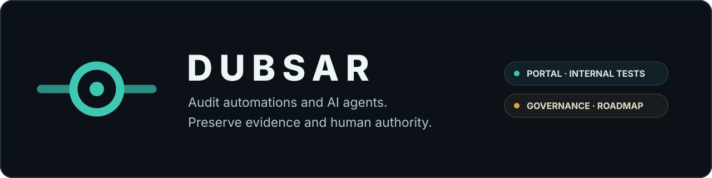

<p align="center">
  
</p>

# DUBSAR

**Audit your automations. Govern what can act.**

DUBSAR connects facts, decisions and evidence across workflows. It makes inconsistencies visible, preserves coverage limitations and returns validation to the designated human authority.

DUBSAR currently has three distinct surfaces. They share one doctrine, but they do not have the same use or maturity level.

[Explore the audit](https://dubsar.ai/audit) · [Request beta access](https://dubsar.ai/early-access) · [Version française](README.fr.md)

---

## Three surfaces, one method

| Surface | Purpose | Current status |
|---|---|---|
| **Automated audit** | Examine a bounded set of automations, connect available events and prepare a reviewable report | Portal under construction and validation; coming soon |
| **Professional DUBSAR Audit** | Examine a project or automation under an agreed mandate, with authorized sources and human review | Available on request |
| **DUBSAR for coding agents** | Govern a software project while AI coding agents help build it | Controlled private beta, Claude Code first |

These surfaces must remain distinct:

- the portal prepares a structured first result;
- the professional audit adds a mandate, analysis and human review;
- the coding-agent product governs a project during construction.

---

## 1. Automated audit

The public audit page is the current commercial entry point. The automated
portal itself is under construction and validation and is not yet publicly
available.

The intended journey is straightforward:

1. define the automations, period and authorized sources;
2. connect available events without inventing causality;
3. surface inconsistencies, uncertainty and missing information;
4. let the designated owner classify the findings;
5. produce a report where evidence, limitations and validations remain connected.

The journey aims to be self-service through the first report. Self-service does not mean automatic authority, certification or removal of human responsibility.

[Explore the automated audit](https://dubsar.ai/audit)

---

## 2. Professional DUBSAR Audit

Professional DUBSAR Audit is a bounded engagement operated by Sofiane with DUBSAR.

Two primary mandates are available:

- **launch readiness** — is the product genuinely ready to open to users?
- **agent governance** — can the team explain and verify how the project was built and approved?

Each engagement begins with explicit agreement on:

- scope;
- authorized sources;
- permissions;
- access limitations;
- retention;
- timing;
- price.

Read-only operation is the default. The report keeps facts, inferences, contradictions, limitations and human decisions separate.

[Read the method](AUDIT.md) · [Request support on Malt](https://www.malt.fr/profile/sofianekotni)

---

## 3. DUBSAR for coding agents

DUBSAR for coding agents governs long-running, multi-session software projects assisted by AI.

The product preserves:

- the Mission and active constraints;
- decisions and their reasons;
- evidence tied to sources and versions;
- contradictions across tickets, documentation, code and tests;
- session identity and isolation;
- Human Gates for protected movement;
- the path required to resume or explain the project.

Claude Code is the first integration. The functional private beta is being finalized for selected external projects, with Windows as the first target.

The historical public Marketplace surface has been retired from the active
repository tree. No generally available self-installation path is currently
claimed. Codex, Cursor and other adapters remain future direction.

[Current status](STATUS.md) · [Technical surfaces](PRODUCT_SURFACES.md) · [Request beta access](https://dubsar.ai/early-access)

---

## Shared doctrine

Every DUBSAR surface follows the same principles:

- only authorized sources are examined;
- a claim is never treated as evidence;
- facts and inferences remain separate;
- evidence provenance and versions are preserved;
- contradictions and limitations remain visible;
- an unavailable source becomes a limitation, not implicit conformity;
- read-only access is the default;
- no agent can approve its own work;
- protected decisions remain under human authority.

**Systems analyze and apply declared rules. DUBSAR preserves and checks. Humans authorize and decide.**

---

## Technical surfaces

The automated audit and coding-agent product use the same discipline through different technical journeys.

### Audit journey

```text
Authorized sources
    ↓
DUBSAR Portal
    ↓
Evidence, inconsistencies and limitations
    ↓
Human validation
    ↓
Report
```

Continuous governance or deployment of a DUBSAR Node is a separate path. It is not implied by the initial diagnostic.

### Coding-agent journey

```text
Coding agent
    ↓
Host adapter
    ↓
Bridge and local runtime
    ↓
Protected Backend and Core
    ↓
Cockpit, evidence and Human Gates
```

The proprietary Core remains private. Technical components are not separate product brands.

---

## AI Act

DUBSAR can help structure material relevant to AI Act documentation readiness:

- inventories of systems, agents, owners and purposes;
- traceability across sources, versions, decisions and validations;
- explicit human oversight;
- limitations, uncertainty and missing information;
- evidence and contradiction registers.

DUBSAR does not provide legal advice, issue certification or produce an automatic compliance verdict.

---

## Public and private boundary

This repository is DUBSAR’s public documentation and distribution boundary.

It may contain:

- public doctrine and architecture;
- bounded examples and diagrams;
- public security, privacy and installation information;
- authorized host adapters.

It does not publish:

- the proprietary Core;
- internal policies or sealed journals;
- client or tester data;
- secrets, tokens or trust material;
- private Backend implementation details.

Some technical identifiers still use `scribe` for compatibility. They do not represent a second public product.

---

## Documentation

### Understand DUBSAR

1. [Why DUBSAR?](WHY_DUBSAR.md)
2. [DUBSAR Audit](AUDIT.md)
3. [Product and surfaces](PRODUCT_SURFACES.md)
4. [Current status](STATUS.md)
5. [Architecture](ARCHITECTURE.md)
6. [FAQ](FAQ.md)
7. [Roadmap](ROADMAP.md)

### Distribution and trust

- [Installation](INSTALLATION.md)
- [Marketplace](MARKETPLACE.md)
- [Security](SECURITY.md)
- [Privacy](PRIVACY.md)
- [Integrity and provenance](INTEGRITY.md)

---

## Created by

Created by [**Sofiane Kotni**](https://dubsar.ai/sofiane-kotni/), creator of DUBSAR and author of *Digital Trust*.

[DUBSAR website](https://dubsar.ai/) · [LinkedIn](https://www.linkedin.com/in/sofiane-kotni/) · [Digital Trust — English](https://www.amazon.fr/dp/B0GZ4RH1KX) · [Digital Trust — French](https://www.amazon.fr/dp/B0H739BFJP) · [Amazon author page](https://www.amazon.fr/stores/Sofiane-KOTNI/author/B0H6NBHZTC) · [Malt](https://www.malt.fr/profile/sofianekotni) · [Contact](mailto:contact@dubsar.ai)
